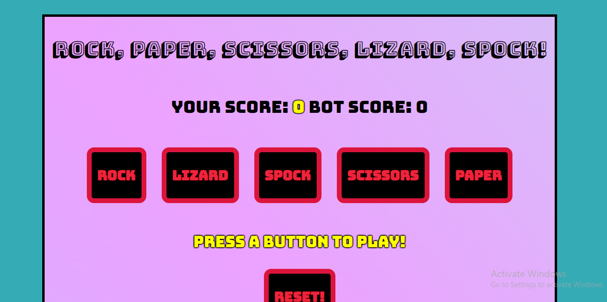

# RockPaperScissorsLizardSpock
I'm sure you have heard of the classic game Rock, Paper, Scissors. Well, this is an extension of it. Rock beats Scissors and Lizard, Scissors beats Paper and Lizard, Paper beats Rock and Spock, Lizard beats Paper and Spock, and Spock beats Rock and Scissors. Whew! Now that you have the rules down, give it a shot.

## How It's Made
**Tech Used:** HTML, CSS, JavaScript, Node js, and an API
While making this I really wanted to get more use of working with the server side. I used some functionality on my main js folder, but kept the functions of counting the score and processing who wins on the server side, using node.

## Lessons Learned
I wanted to push to add a score for the computer in addition to the player's score. This was a challenge at first, as the score would show NaN, but after trying different techniques, I was able to get the score to display accurately.

## Installation

1. Clone repo
2. run `npm install`

## Usage

1. run `node server.js`
2. Navigate to `localhost:8000`
